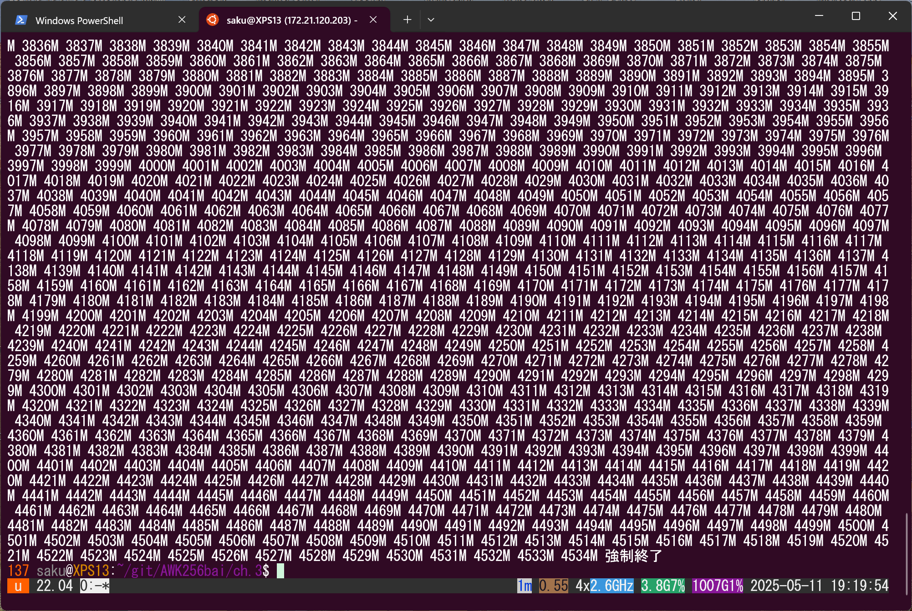

 # awkの舞台裏を探る！
 ## 文字列を自在に
 ### 文字列の長さ
 p.89  
 そこで変数に文字列を連結していき、どのくらいの長さで実行エラーとなるか調べてみることにした。オリジナルはKB単位で連結する仕様だが、1024倍のMB単位で追実験をしてみた。
 ```
 $ awk -f strlenM.awk
1M 2M 3M 4M 5M 6M 7M 8M 9M 10M 11M 12M 13M 14M 15M 16M 17M 18M 19M 20M 21M 22M 23M 24M 25M 26M 27M 28M 29M 30M 31M 32M 33M 34M 35M 36M 37M 38M 39M 40M 41M 42M 43M 44M 45M 46M 47M 48M 49M 50M 51M 52M 53M 54M 55M 56M 57M 58M 59M 60M 61M 62M 63M 64M 65M 66M 67M 68M 69M 70M 71M 72M 73M 74M 75M 76M 77M 78M 79M 80M 81M 82M 83M 84M 85M 86M 87M 88M 89M 90M 91M 92M 93M 94M 95M 96M 97M 98M 99M 100M 101M 102M 103M 104M 105M 106M 107M 108M 109M 110M 111M 112M 113M 114M 115M 116M 117M 118M 119M 120M 121M 122M 123M 124M 125M 126M 127M 128M 129M 130M 131M 132M 133M 134M 135M 136M 137M 138M 139M 140M 141M 142M 143M 144M 145M 146M 147M 148M 149M 150M 151M 152M 153M 154M 155M 156M 157M 158M 159M 160M 161M 162M 163M 164M 165M 166M 167M 168M 169M 170M 171M 172M 173M 174M 175M 176M 177M 178M 179M 180M 181M 182M 183M 184M 185M 186M 187M 188M 189M 190M 191M 192M 193M 194M 195M 196M 197M 198M 199M 200M 201M 202M 203M 204M 205M 206M 207M 208M 209M 210M 211M 212M 213M 214M 215M ...以下略
 ```
   
 概ね実メモリサイズまで連結できるようだ。  
 