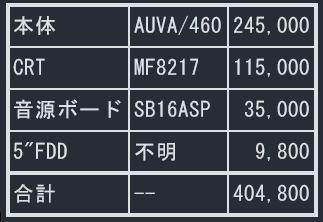
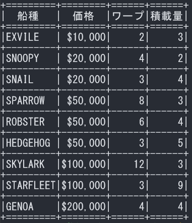

# 表プロセッサ
```
$ awk -f hyou.awk -- -a dosv.txt
+==========+========+=======+
|本体      |AUVA/460|245,000|
+----------+--------+-------+
|CRT       |MF8217  |115,000|
+----------+--------+-------+
|音源ボード|SB16ASP | 35,000|
+----------+--------+-------+
|5"FDD     |不明    |  9,800|
+==========+========+=======+
|合計      |--      |404,800|
+==========+========+=======+
$ awk -f hyou.awk -- -j dosv.txt
┏━━━━━━━━━━┯━━━━━━━━┯━━━━━━━┓
┃本体      │AUVA/460│245,000┃
┠──────────┼────────┼───────┨
┃CRT       │MF8217  │115,000┃
┠──────────┼────────┼───────┨
┃音源ボード│SB16ASP │ 35,000┃
┠──────────┼────────┼───────┨
┃5"FDD     │不明    │  9,800┃
┣━━━━━━━━━━┿━━━━━━━━┿━━━━━━━┫
┃合計      │--      │404,800┃
┗━━━━━━━━━━┷━━━━━━━━┷━━━━━━━┛
$ awk -f hyou.awk -- -a hyou.smp
+=========+========+======+======+
|  船種   |  価格  |ワープ|積載量|
+=========+========+======+======+
|EXVILE   | $10,000|     2|     3|
+---------+--------+------+------+
|SNOOPY   | $20,000|     4|     2|
+---------+--------+------+------+
|SNAIL    | $20,000|     3|     4|
+---------+--------+------+------+
|SPARROW  | $50,000|     8|     3|
+---------+--------+------+------+
|ROBSTER  | $50,000|     6|     4|
+---------+--------+------+------+
|HEDGEHOG | $50,000|     3|     5|
+---------+--------+------+------+
|SKYLARK  |$100,000|    12|     3|
+---------+--------+------+------+
|STARFLEET|$100,000|     3|     9|
+---------+--------+------+------+
|GENOA    |$200,000|     4|     4|
+=========+========+======+======+
$ awk -f hyou.awk -- -j hyou.smp
┏━━━━━━━━━┯━━━━━━━━┯━━━━━━┯━━━━━━┓
┃  船種   │  価格  │ワープ│積載量┃
┣━━━━━━━━━┿━━━━━━━━┿━━━━━━┿━━━━━━┫
┃EXVILE   │ $10,000│     2│     3┃
┠─────────┼────────┼──────┼──────┨
┃SNOOPY   │ $20,000│     4│     2┃
┠─────────┼────────┼──────┼──────┨
┃SNAIL    │ $20,000│     3│     4┃
┠─────────┼────────┼──────┼──────┨
┃SPARROW  │ $50,000│     8│     3┃
┠─────────┼────────┼──────┼──────┨
┃ROBSTER  │ $50,000│     6│     4┃
┠─────────┼────────┼──────┼──────┨
┃HEDGEHOG │ $50,000│     3│     5┃
┠─────────┼────────┼──────┼──────┨
┃SKYLARK  │$100,000│    12│     3┃
┠─────────┼────────┼──────┼──────┨
┃STARFLEET│$100,000│     3│     9┃
┠─────────┼────────┼──────┼──────┨
┃GENOA    │$200,000│     4│     4┃
┗━━━━━━━━━┷━━━━━━━━┷━━━━━━┷━━━━━━┛
$
```
## 等幅フォントの場合以下のように幅が揃うはず
  
  

# 背景
本書はMS_DOS版gawkを前提に書かれている。MS-DOSとは、ビットマップディスプレイなど高嶺の花の時代、キャラクタディスプレイで動作した。キャラクタディスプレイとは、画面全体が80×25文字のキャラクタ（文字）のみ表示できるディスプレイであった。その環境で日本人が大好きな罫線で表を作成しようと思ったら罫線を文字として使用するしかなかった。これはそんな時代の便利ツールである。  
MS-DOSは、今でいう等幅フォントである。物理的に漢字フォントは半角英数字のきっちり2倍の幅であった。キャラクタディスプレイはそうとしか表示できなかった。これはシフトJISと組み合わせると良いこともあった。全角文字は必ず2バイトで幅は半角文字の2倍なので文字幅とバイト数が一致していたのである。元のプログラムはシフトJISのこの特性を利用していたので、UTF-8対応に際して補正ロジックを追加した。2025.5.7
